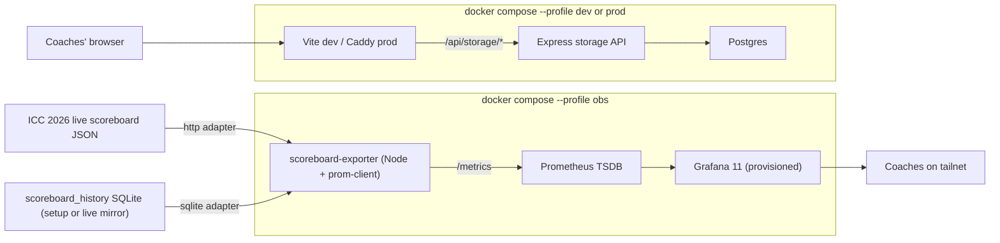

# Coach Command Center

USCT live coaching surface for ICC 2026 (and other attack/defense CTFs).

It bundles two independent stacks behind one repo and one `docker-compose.yml`:

1. **Coach app** — a React/Vite dashboard for coaches to track challenges,
   roster, and event timing. Backed by a small Express/Postgres storage API.
2. **Observability stack** — a Prometheus + Grafana + scoreboard-exporter
   pipeline that consumes the ICC 2026 attack/defense scoreboard JSON and
   renders leaderboard, point-velocity, forecast, and component-breakdown
   views.

The two stacks share nothing at runtime. You can run either one alone or both
together.

### Hot reloading (all dev services)

Every development-facing service reloads on save — no manual rebuilds for
day-to-day edits:

| Service | Profile | What reloads automatically |
| ------- | ------- | -------------------------- |
| Coach frontend | `dev` | Vite HMR — `coach-command-center.jsx`, `src/*`, CSS |
| Coach API | `dev` | `node --watch` — `server/index.js` |
| Scoreboard exporter | `obs` | `node --watch` — `scoreboard-exporter/src/**` |
| Prometheus | `obs` | Config file watcher → `POST /-/reload` on save |
| Grafana dashboards | `obs` | File provisioner polls every **5 s** — `ops/grafana/dashboards/*.json` |

Still requires a container **restart** (not just a save):

- `package.json` / new npm deps → restart the affected service
- `vite.config.js`, `docker-compose.yml`, `.env` wiring → restart affected containers
- Grafana **datasource** provisioning (`ops/grafana/provisioning/datasources/`) → `docker compose --profile obs restart grafana`

Optional: run `docker compose watch` alongside `up` for Compose-native file sync
(the `develop.watch` blocks in `docker-compose.yml` cover exporter, Prometheus,
and Grafana paths).

---

## Table of Contents

- [Quickstart](#quickstart)
- [What's in the box](#whats-in-the-box)
- [Repository layout](#repository-layout)
- [Architecture](#architecture)
- [Host prerequisites](#host-prerequisites)
- [Configuration](#configuration)
- [Running the coach app](#running-the-coach-app)
- [Running the observability stack](#running-the-observability-stack)
- [Scoreboard data sources](#scoreboard-data-sources)
- [Metrics emitted by the exporter](#metrics-emitted-by-the-exporter)
- [Grafana dashboard tour](#grafana-dashboard-tour)
- [Operations](#operations)
- [Troubleshooting](#troubleshooting)
- [Security posture](#security-posture)
- [For agents and future contributors](#for-agents-and-future-contributors)

---

## Quickstart

Assumes Docker Engine and Docker Compose plugin are installed (see
[Host prerequisites](#host-prerequisites) for a fresh-Ubuntu walkthrough).

```bash
# 1. Configure
cp .env.example .env
# Edit .env if you want to change passwords, ports, or wire up live data.

# 2. Bring everything up
docker compose --profile dev --profile obs up -d --build

# 3. Open the URLs
#   Coach app:     http://localhost:5173
#   Coach API:     http://localhost:3000/health
#   Grafana:       http://localhost:3001    (admin / coach-admin by default)
#   Prometheus:    http://localhost:9090
#   Exporter:      http://localhost:9101/metrics

# 4. Verify the obs stack is producing real data
curl -fsS http://127.0.0.1:9101/healthz
curl -fsS 'http://127.0.0.1:9090/api/v1/query?query=count(team_total_score)'
```

On first boot, the exporter replays
`grafana/setup_data/scoreboard_history_setup.db` (46 real ICC 2026 setup ticks
across 9 teams and 8 services) so every panel on the `Scoreboard` dashboard
populates immediately. No organizer credentials required for the dry-run.

To switch the exporter to the live event:

```dotenv
# .env
SCOREBOARD_SOURCE=http
SCOREBOARD_HTTP_URL=https://scoreboard.example/icc-2026.json
SCOREBOARD_HTTP_POLL_INTERVAL_SECONDS=120
```

```bash
docker compose --profile obs up -d scoreboard-exporter
```

---

## What's in the box

| Concern              | Component                                 | Default port  |
| -------------------- | ----------------------------------------- | ------------- |
| Coaches' web UI      | Vite/React (`coach-command-center.jsx`)   | 5173 (dev)    |
| Coaches' storage API | Express + Postgres (`server/index.js`)    | 3000          |
| Production web       | Caddy serving the built React bundle      | 80 / 443      |
| Scoreboard exporter  | Node + prom-client (`scoreboard-exporter/`)| 9101         |
| Time-series DB       | Prometheus                                | 9090          |
| Visualization        | Grafana 11 (provisioned dashboard)        | 3001          |
| Durable state        | Postgres 16 (coach app), Prom TSDB (obs)  | n/a           |

Compose profiles:

- `dev` — live-reload coach app (Vite + Node watch mode) + Postgres.
- `prod` — production coach app: built React assets behind Caddy + Express API + Postgres.
- `obs` — Prometheus + Grafana + scoreboard-exporter (independent of `dev`/`prod`).

---

## Repository layout

```
coach-command-center/
├── coach-command-center.jsx          # Main React app (single big file by design)
├── docker-compose.yml                # dev / prod / obs profiles
├── Dockerfile                        # Production build stages (api, web)
├── .env.example                      # All tunables, copy to .env
├── server/
│   └── index.js                      # Express storage API (/api/storage)
├── src/
│   ├── main.jsx                      # React entrypoint
│   ├── storage-client.js             # window.storage facade -> /api/storage
│   └── app.css
├── ops/
│   ├── caddy/Caddyfile               # Prod web serving + /api proxy
│   ├── prometheus/prometheus.yml     # Scrapes scoreboard-exporter every 10s
│   └── grafana/
│       ├── grafana.ini
│       ├── provisioning/
│       │   ├── datasources/prometheus.yml   # uid pinned to PBFA97CFB590B2093
│       │   └── dashboards/coach.yml         # file provider config
│       └── dashboards/
│           └── coach-scoreboard.json        # The provisioned dashboard
├── scoreboard-exporter/
│   ├── Dockerfile
│   ├── package.json
│   └── src/
│       ├── index.js                  # express + adapter wiring
│       ├── parse.js                  # ICC payload -> normalized snapshot
│       ├── metrics.js                # prom-client gauges + delta state
│       └── adapters/
│           ├── http.js               # SCOREBOARD_SOURCE=http
│           └── sqlite.js             # SCOREBOARD_SOURCE=sqlite (replay + tail)
└── grafana/
    ├── Coach_Grafana_original.json   # Inherited v13 dashboard (kept for reference)
    └── setup_data/
        └── scoreboard_history_setup.db  # 46 real ICC 2026 setup ticks
```

---

## Architecture



Two key boundaries to respect:

- **The coach app talks to `window.storage`**, which posts to `/api/storage`.
  Persisted shapes (`challenge:*`, `team-roster`, `event-settings`) are owned
  by the React app; the API just stores strings under a namespace.
- **The exporter is the only piece that knows the ICC payload shape.** Anything
  downstream (Prometheus, Grafana, alerts) consumes a stable metric vocabulary
  (`team_total_score`, `team_offense_delta`, etc.), so a scoreboard schema
  change only touches `scoreboard-exporter/src/parse.js`.

---

## Host prerequisites

Tested on Ubuntu 24.04. Install once:

```bash
sudo apt update
sudo apt install -y ca-certificates curl git ufw

sudo install -m 0755 -d /etc/apt/keyrings
sudo curl -fsSL https://download.docker.com/linux/ubuntu/gpg \
  -o /etc/apt/keyrings/docker.asc
sudo chmod a+r /etc/apt/keyrings/docker.asc

echo \
  "deb [arch=$(dpkg --print-architecture) signed-by=/etc/apt/keyrings/docker.asc] https://download.docker.com/linux/ubuntu \
  $(. /etc/os-release && echo "$VERSION_CODENAME") stable" | \
  sudo tee /etc/apt/sources.list.d/docker.list > /dev/null

sudo apt update
sudo apt install -y docker-ce docker-ce-cli containerd.io \
                    docker-buildx-plugin docker-compose-plugin
sudo usermod -aG docker "$USER"
```

Log out and back in so the `docker` group takes effect.

Recommended firewall (note that the obs profile binds publishes 3001/9090/9101
on `0.0.0.0` by default; lock those down or expose only over Tailscale/SSH):

```bash
sudo ufw allow OpenSSH
sudo ufw allow 80/tcp
sudo ufw allow 443/tcp
sudo ufw enable
```

---

## Configuration

Everything lives in `.env`. Start from `.env.example`:

```bash
cp .env.example .env
```

### Coach app

| Variable             | Default                        | Notes |
| -------------------- | ------------------------------ | ----- |
| `POSTGRES_USER`      | `coach`                        |       |
| `POSTGRES_PASSWORD`  | `change-this-before-live-use`  | **Change before any non-toy use.** |
| `POSTGRES_DB`        | `coach_command_center`         |       |
| `APP_NAMESPACE`      | `coach-command-center`         | Logical namespace inside the `storage_items` table. Use a new value per event to keep histories separate in one DB. |
| `APP_SITE_ADDRESS`   | `:80`                          | Caddy site address (prod). Use `coach.example.com` for automatic HTTPS. |
| `HTTP_PORT`          | `80`                           |       |
| `HTTPS_PORT`         | `443`                          |       |
| `WEB_DEV_PORT`       | `5173`                         |       |
| `API_DEV_PORT`       | `3000`                         |       |
| `CHOKIDAR_USEPOLLING`| `true`                         | Needed for HMR over bind mounts on Linux. |
| `CORS_ORIGIN`        | (empty)                        | Set only if calling the API from a different origin than the bundled Vite proxy. |

### Observability stack

| Variable                                  | Default     | Notes |
| ----------------------------------------- | ----------- | ----- |
| `OBS_GRAFANA_PORT`                        | `3001`      | Host port that maps to Grafana's 3000. |
| `OBS_PROM_PORT`                           | `9090`      |       |
| `OBS_EXPORTER_PORT`                       | `9101`      |       |
| `GRAFANA_ADMIN_USER`                      | `admin`     |       |
| `GRAFANA_ADMIN_PASSWORD`                  | `coach-admin` | **Change before exposing beyond the tailnet.** |
| `SCOREBOARD_SOURCE`                       | `sqlite`    | `sqlite` for replay / fallback; `http` for the live event. |
| `SCOREBOARD_HTTP_URL`                     | (empty)     | Live scoreboard JSON endpoint. |
| `SCOREBOARD_HTTP_POLL_INTERVAL_SECONDS`   | `120`       | Once per ICC tick by default. Lower (30–60) if the endpoint can serve mid-tick updates. |
| `SCOREBOARD_HTTP_TIMEOUT_MS`              | `4000`      | Per-request timeout for the http adapter. |
| `SCOREBOARD_SQLITE_PATH`                  | `/data/setup_data/scoreboard_history_setup.db` | Path inside the exporter container. The compose file bind-mounts `grafana/setup_data/` to `/data/setup_data:ro`. |
| `SCOREBOARD_SQLITE_POLL_INTERVAL_SECONDS` | `5`         | How often to poll the DB for new rows. Cheap because local. |
| `REPLAY_RATE`                             | `fast`      | `fast` replays the whole history as fast as scrapes allow (best for dev). `realtime` paces emission by `GAME_TICK_LENGTH_SECONDS`. |
| `OUR_TEAM_NAME`                           | `Team USA`  | Which team in the scoreboard payload populates the `our_*` metrics. |
| `GAME_TICK_LENGTH_SECONDS`                | `120`       | Canonical tick length. Drives `game_seconds_to_next_tick` and realtime replay pacing. |

The exporter only opens the SQLite file when `SCOREBOARD_SOURCE=sqlite`, so
`SCOREBOARD_SQLITE_PATH` is irrelevant in `http` mode.

---

## Running the coach app

### Live development

```bash
docker compose --profile dev up -d
```

Frontend hot-reloads through Vite at `http://localhost:5173`. The API container
runs under `node --watch`, so editing `server/index.js` restarts it
automatically. Open `http://localhost:3000/health` to confirm the API.

Tailnet URLs on this host:

- `http://cyberteam:5173` (frontend)
- `http://cyberteam:3000/health` (API)

### Production-style

```bash
docker compose --profile prod up -d --build
```

The `web` container builds the React bundle and serves it through Caddy, which
also reverse-proxies `/api/*` to the Express container. Postgres data lives in
the `postgres_data` named volume and survives `down`.

Watch logs:

```bash
docker compose --profile prod logs -f
```

### Common coach-app operations

```bash
# Restart only one service after editing config
docker compose --profile dev restart web-dev
docker compose --profile dev restart api-dev

# Open a psql shell
docker compose exec db psql -U "$POSTGRES_USER" -d "$POSTGRES_DB"

# Reset containers, KEEP the database
docker compose --profile prod down
docker compose --profile prod up -d --build

# Reset EVERYTHING including volumes (destroys coach data, Prom, Grafana)
docker compose down -v
```

`docker compose down -v` wipes `postgres_data`, `prometheus_data`, and
`grafana_data`. Do not run it during a live event.

---

## Running the observability stack

```bash
docker compose --profile obs up -d --build
```

Four containers come up: `scoreboard-exporter`, `prometheus`,
`prometheus-config-reloader`, and `grafana`.

All obs dev paths hot-reload on save — see [Hot reloading](#hot-reloading-all-dev-services) above.

Open:

- Grafana — `http://localhost:3001` (admin / `coach-admin` by default).
  The `Scoreboard` dashboard is provisioned and set as the default home.
- Prometheus — `http://localhost:9090`
- Exporter — `http://localhost:9101/metrics` and `/healthz`

### Sanity checks

```bash
curl -fsS http://127.0.0.1:9101/healthz
# -> {"ok":true,"source":"sqlite","our_team":"Team USA","last_tick":45, ...}

curl -fsS http://127.0.0.1:9090/-/ready
# -> Prometheus Server is Ready.

curl -fsS http://127.0.0.1:3001/api/health
# -> {"database":"ok","version":"11.3.0", ...}

curl -fsS 'http://127.0.0.1:9090/api/v1/query?query=count(team_total_score)'
# -> 9 (one per ICC 2026 team)
```

### Restart only the exporter (after .env change)

```bash
docker compose --profile obs up -d scoreboard-exporter
```

Prometheus picks up new metric series automatically. Grafana picks up dashboard
file changes within about 5 s via provisioning (no restart needed for JSON edits
under `ops/grafana/dashboards/`).

---

## Scoreboard data sources

The exporter ships with two real input adapters. Pick the one that fits the
current phase of the event.

### `SCOREBOARD_SOURCE=sqlite` (default)

Reads from any SQLite DB with this schema (the same one the organizers' setup
DB uses):

```sql
CREATE TABLE scoreboard_history (
  id   INTEGER PRIMARY KEY AUTOINCREMENT,
  tick INTEGER NOT NULL UNIQUE,
  time TEXT    NOT NULL,
  data TEXT    NOT NULL  -- the full scoreboard JSON for that tick
);
```

The adapter:

1. On startup, replays every row in tick order (subject to `REPLAY_RATE`).
2. Then polls every `SCOREBOARD_SQLITE_POLL_INTERVAL_SECONDS` looking for
   `tick > last_seen_tick`. Emits each new row as it appears.

Use this for:

- Local dashboard development against `grafana/setup_data/scoreboard_history_setup.db`.
- A live-event fallback if you mirror the organizers' JSON into a local SQLite.
- Post-event analysis / replays.

### `SCOREBOARD_SOURCE=http`

Polls a URL that returns the same JSON shape as the `data` column above.
Default cadence is `SCOREBOARD_HTTP_POLL_INTERVAL_SECONDS=120` (one ICC tick).
Use this during the live event.

### Expected JSON shape

```json
{
  "tick": 45,
  "teams": {
    "8": {
      "team_id": "8",
      "name": "Team USA",
      "score": 31326.06,
      "scores": {
        "offense_total": 1708.95, "offense_tick": 0.0,
        "defense_total": -682.52, "defense_tick": 0.0,
        "service_total": 36026.43, "service_tick": -117.85
      },
      "services": {
        "ExCCel-1": {
          "offense_total": 0.0,  "offense_tick": 0.0,
          "defense_total": -232.47, "defense_tick": 0.0,
          "service_total": 86.67, "service_tick": 0.31,
          "flags_gained": 0, "flags_lost": 15,
          "flags_gained_tick": 0, "flags_lost_tick": 0,
          "current_status": "UP",
          "current_error": "CHECK_SLA:OK\nGET_FLAG:OK",
          "status_history": [/* per-tick history */],
          "up_ticks": 39
        }
      }
    }
  }
}
```

If the live ICC payload diverges from this shape, the only file to update is
`scoreboard-exporter/src/parse.js`.

---

## Metrics emitted by the exporter

Grouped by purpose. All metrics are Prometheus gauges unless noted.

### Compatibility with the original Grafana export

These match the names the inherited dashboard already queries, so any panel
written against them keeps working unchanged.

- `team_total_score{team, team_id}`
- `team_delta_score{team, team_id}` — set when `payload.tick` advances
- `team_flags_gained_delta{team, team_id, service_name, service_family, service_instance}`
- `team_flags_lost_delta{team, team_id, service_name, service_family, service_instance}`
- `team_service_status{team, team_id, service_name, ...}` — numeric mapping:
  `UP=3, PARTIAL=1, DOWN=-1, unknown=-2`. The existing dashboards' `+ 2` query
  math lights up correctly.
- `our_total_score`, `our_delta_score`
- `our_flags_gained_delta{service_name, service_directory, ...}`
- `our_flags_lost_delta{service_name, ...}`
- `our_service_status{service_name, service_directory, ...}`
- `game_current_tick`, `game_tick_length_seconds`, `game_seconds_to_next_tick`

### New: component-level breakdown

Coaches need to see *why* a team's score is moving, not just the total.

- `team_offense_total{team, team_id}`
- `team_defense_total{team, team_id}` — typically negative
- `team_service_total{team, team_id}` — SLA bank
- `team_offense_delta{team, team_id}`
- `team_defense_delta{team, team_id}`
- `team_service_delta{team, team_id}`

### New: per-team per-service detail

- `team_flags_gained_total{team, team_id, service_name, ...}` — running counter
- `team_flags_lost_total{team, team_id, service_name, ...}` — running counter
- `team_service_score{team, team_id, service_name, ...}`
- `team_service_up_ticks{team, team_id, service_name, ...}` — SLA in ticks
- `team_service_offense_delta{team, team_id, service_name, ...}`
- `team_service_defense_delta{team, team_id, service_name, ...}`

### Exporter self-health

- `exporter_last_tick{source}` — last tick observed
- `exporter_last_emit_unix{source}` — Unix seconds at last emission
- `exporter_errors_total{source, kind}` — counter
- All `prom-client` Node defaults under prefix `exporter_` (CPU, memory, GC, event-loop lag, ...)

### Useful PromQL recipes

```promql
# Smoothed velocity (3 ticks)
topk(15, avg_over_time(team_delta_score[6m]))

# Points per minute
deriv(team_total_score[10m]) * 60

# 10-minute forecast leaderboard
sort_desc(predict_linear(team_total_score[15m], 600))

# Gap to USCT (now)
team_total_score - on() group_left scalar(team_total_score{team="Team USA"})

# Who is attacking what (last 15 minutes)
sort_desc(sum by (team, service_name) (increase(team_flags_gained_total[15m])))

# SLA per service for USCT
team_service_up_ticks{team="Team USA"} / ignoring(service_name) group_left game_current_tick
```

---

## Grafana dashboard tour

Provisioned at `/d/coach-scoreboard/scoreboard` from
`ops/grafana/dashboards/coach-scoreboard.json`. Two dashboard variables:

- `$team` — populated by `label_values(team_total_score, team)`. Defaults to
  `Team USA`. Drives every per-team panel.
- `$ticklen` — interval (`30s,1m,90s,2m,3m,4m,5m`). Defaults to `2m` to match
  the ICC tick length.

Four rows, 22 panels:

1. **Standings** — `$team` total score, current tick, seconds to next tick,
   leaderboard table, total-score-over-time per team.
2. **Team Point Velocity** — velocity now, smoothed 3-tick velocity, points per
   minute, acceleration, 10-minute forecast, gap-to-`$team` table, top gainers
   and losers over the last three ticks.
3. **Score Component Breakdown** — offense / defense / service velocity per
   team, `$team` stacked component split, `$team` per-service flag flow with
   `UP/PARTIAL/DOWN/?` cells, "who attacks what" 15-min flag leaderboard.
4. **USCT Service Health** — `$team` SLA history per service (status-history
   viz), flags gained per service per tick, flags lost per service per tick.

Edit the dashboard JSON directly in the repo and Grafana will pick up changes
within 30 s thanks to provisioning. You can also edit live in the UI to
prototype — those edits live in `grafana_data` and won't survive a volume reset
unless you export and write back to the JSON file.

---

## Operations

### One-off tasks

```bash
# Rebuild only the exporter after editing scoreboard-exporter/
docker compose --profile obs up -d --build scoreboard-exporter

# Tail exporter logs (JSON lines)
docker compose --profile obs logs -f scoreboard-exporter

# Stop the obs stack but keep the coach app running
docker compose --profile obs down

# Bring up everything (coach app + obs) at once
docker compose --profile dev --profile obs up -d --build
```

### Switching to the live event

```bash
# In .env
SCOREBOARD_SOURCE=http
SCOREBOARD_HTTP_URL=https://scoreboard.example/icc-2026.json
# Optional: override the default 120 s cadence
SCOREBOARD_HTTP_POLL_INTERVAL_SECONDS=60

docker compose --profile obs up -d scoreboard-exporter
docker compose --profile obs logs -f scoreboard-exporter
# Look for: {"level":"info","msg":"tick observed","source":"http","tick":N,"teams":9}
```

If you suspect the HTTP endpoint is flaking, fall back to mirroring the JSON
into a local SQLite with the same schema and pointing the exporter at it:

```bash
# .env
SCOREBOARD_SOURCE=sqlite
SCOREBOARD_SQLITE_PATH=/data/setup_data/your_live_mirror.db
REPLAY_RATE=fast   # so the exporter doesn't rewind real-time

docker compose --profile obs up -d scoreboard-exporter
```

### Backing things up

The only durable state worth backing up between sessions:

- `postgres_data` — coach app data (challenges, roster, notes, event settings).
- `prometheus_data` — historical metrics for post-game review.
- `grafana_data` — saved dashboard edits, users, API keys.

Use `docker run --rm -v coach-command-center_postgres_data:/v alpine tar ...`
style commands or a `pg_dump` from the running container for Postgres.

---

## Troubleshooting

### Coach app

- **`docker compose --profile dev ps` shows a service unhealthy** — `docker
  compose --profile dev logs --tail=200 <service>`. If `web-dev` says
  "Blocked request. This host is not allowed", add the hostname to
  `vite.config.js`'s `server.allowedHosts` and `restart web-dev`.
- **API 500s with `database is locked` or `connection refused`** — confirm
  `db` is healthy with `docker compose ps`. The API depends on it via a
  healthcheck.
- **Browser-side `window.storage` calls fail with 404** — confirm
  `curl http://127.0.0.1:3000/health` returns `{ok:true}` and that the Vite
  dev proxy is routing `/api/*` to `api-dev:3000`.

### Observability stack

- **Grafana shows "No data" everywhere** — likely the exporter hasn't observed
  a tick yet. `curl http://127.0.0.1:9101/healthz`; `last_tick` should not be
  `-1`. If it is, check `docker compose logs scoreboard-exporter` for parse
  errors.
- **Prometheus target is DOWN** — `curl
  http://127.0.0.1:9090/api/v1/targets?state=active`. The exporter target
  should report `health: up`. If not, `docker compose --profile obs ps` to
  confirm the container is healthy and that port 9101 is reachable from
  inside the compose network.
- **Exporter logs `sqlite adapter: cannot open ...`** — the
  `grafana/setup_data/` directory bind-mount failed. Confirm the file exists
  on the host (`ls grafana/setup_data/`) and the path in
  `SCOREBOARD_SQLITE_PATH` matches the in-container path
  `/data/setup_data/...`.
- **Live HTTP mode times out** — bump `SCOREBOARD_HTTP_TIMEOUT_MS=10000` and
  watch `exporter_errors_total{source="http"}` rise in Prometheus. If you see
  `http_403/401`, the organizers' endpoint likely needs an auth header; add
  it via a small fetch-header patch in `scoreboard-exporter/src/adapters/http.js`.
- **Dashboard panels render but Status column shows raw numbers** — that's
  expected if you query `team_service_status` directly. The dashboard's
  status mappings live on the column overrides; queries that bypass them
  will show the raw `-2 / -1 / 1 / 3` ints.

### Hard reset

```bash
docker compose down -v        # destroys coach DB, Prom, Grafana volumes
docker compose --profile dev --profile obs up -d --build
```

---

## Security posture

- The stack is designed for **tailnet-only access**. Bind ports
  `5173/3000/3001/9090/9101` are all `0.0.0.0` for convenience; lock down with
  `ufw` or Tailscale ACLs before pointing this at a hostile network.
- Caddy (prod profile) supports automatic HTTPS when `APP_SITE_ADDRESS` is a
  real DNS name pointing at the host. For LAN-only, leave it as `:80`.
- Grafana is configured with `auth.anonymous: disabled`. Change
  `GRAFANA_ADMIN_PASSWORD` before any non-local use.
- Postgres is not exposed to the host (the `db` service does not publish 5432).
  Use `docker compose exec db psql` to get a shell.
- Stored challenge data (flags, notes, operators, event timing) may be
  sensitive. Do not commit `.env`. Do not add telemetry or third-party network
  calls without an explicit decision.

---

## For agents and future contributors

Read `AGENTS.md` before making changes. The short version:

- Favor small diffs in `coach-command-center.jsx`. Do not split it up as
  cleanup during unrelated feature work.
- Persisted shapes (`challenge:*`, `team-roster`, `event-settings`) require
  migrations in the existing `migrate` / `migrateRoster` helpers, not a new
  schema.
- The exporter is the only file that knows the scoreboard JSON shape. If the
  shape changes, edit `scoreboard-exporter/src/parse.js`, not the dashboard.
- Do not run `docker compose down -v` during a live event.
- Do not change `vite.config.js` `server.allowedHosts` without restarting
  `web-dev`.
- Ask before adding dependencies, frameworks, auth, telemetry, or new
  Grafana plugins.
