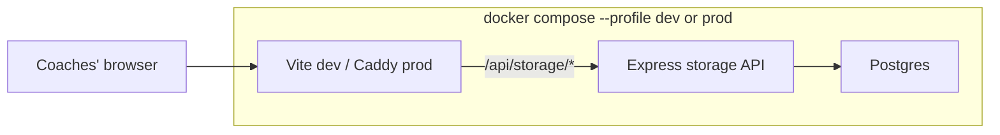

# Coach Command Center

USCT live coaching dashboard for jeopardy-style CTFs. Built for ICC 2026, generic enough for other jeopardy events.

### Hot reloading (dev services)

Every development-facing service reloads on save — no manual rebuilds for
day-to-day edits:

| Service | Profile | What reloads automatically |
| ------- | ------- | -------------------------- |
| Coach frontend | `dev` | Vite HMR — `coach-command-center.jsx`, `src/*`, CSS |
| Coach API | `dev` | `node --watch` — `server/index.js` |

Still requires a container **restart** (not just a save):

- `package.json` / new npm deps → restart the affected service
- `vite.config.js`, `docker-compose.yml`, `.env` wiring → restart affected containers

---

## Table of Contents

- [Quickstart](#quickstart)
- [What's in the box](#whats-in-the-box)
- [Repository layout](#repository-layout)
- [Architecture](#architecture)
- [Host prerequisites](#host-prerequisites)
- [Configuration](#configuration)
- [Running the coach app](#running-the-coach-app)
- [Operations](#operations)
- [Troubleshooting](#troubleshooting)
- [Security posture](#security-posture)
- [For agents and future contributors](#for-agents-and-future-contributors)

---

## Quickstart

Assumes Docker Engine and Docker Compose plugin are installed (see
[Host prerequisites](#host-prerequisites) for a fresh-Ubuntu walkthrough).

```bash
# 1. Configure
cp .env.example .env
# Edit .env if you want to change passwords or ports.

# 2. Bring up the dev stack
docker compose --profile dev up -d

# 3. Open the URLs
#   Coach app:  http://localhost:5173
#   Coach API:  http://localhost:3000/health
```

---

## What's in the box

| Concern              | Component                                 | Default port  |
| -------------------- | ----------------------------------------- | ------------- |
| Coaches' web UI      | Vite/React (`coach-command-center.jsx`)   | 5173 (dev)    |
| Coaches' storage API | Express + Postgres (`server/index.js`)    | 3000          |
| Production web       | Caddy serving the built React bundle      | 80 / 443      |
| Durable state        | Postgres 16                               | n/a           |

Compose profiles:

- `dev` — live-reload coach app (Vite + Node watch mode) + Postgres.
- `prod` — production coach app: built React assets behind Caddy + Express API + Postgres.

### Phase model

New events get a single flat competition timer by default. An optional "locked
phase" feature can be enabled in the settings panel. When enabled, the
competition is split into two named phases (locked and open), and challenges
solved during the locked phase have their score frozen at the end-of-locked-phase
value.

Key settings fields:

| Field | Default | Meaning |
| ----- | ------- | ------- |
| `durationHours` | `9` | Total event length |
| `useLockedPhase` | `false` | Off = single flat timer |
| `lockedPhaseHours` | `7` | Only used when `useLockedPhase=true` |
| `lockedPhaseLabel` | `'Phase 1'` | Display name for locked phase |
| `openPhaseLabel` | `'Phase 2'` | Display name for open phase |

An **ICC 2026 preset** button in settings applies the USCT competition
configuration: 7h Human Resistance (locked, simple AI only) + 2h Robot Uprising
(open, approved AI permitted).

Old events stored with `hrHours`/`ruHours` automatically migrate to the locked-phase
model on first load, preserving their Human Resistance / Robot Uprising labels.

---

## Repository layout

```
coach-command-center/
├── coach-command-center.jsx          # Main React app (single big file by design)
├── docker-compose.yml                # dev / prod profiles
├── Dockerfile                        # Production build stages (api, web)
├── .env.example                      # All tunables, copy to .env
├── server/
│   └── index.js                      # Express storage API (/api/storage)
├── src/
│   ├── main.jsx                      # React entrypoint
│   ├── storage-client.js             # window.storage facade -> /api/storage
│   └── app.css
└── ops/
    └── caddy/Caddyfile               # Prod web serving + /api proxy
```

---

## Architecture



Key boundary: **the coach app talks to `window.storage`**, which posts to
`/api/storage`. Persisted shapes (`challenge:*`, `team-roster`, `event-settings`)
are owned by the React app; the API just stores strings under a namespace.

---

## Host prerequisites

Tested on Ubuntu 24.04. Install once:

```bash
sudo apt update
sudo apt install -y ca-certificates curl git ufw

sudo install -m 0755 -d /etc/apt/keyrings
sudo curl -fsSL https://download.docker.com/linux/ubuntu/gpg \
  -o /etc/apt/keyrings/docker.asc
sudo chmod a+r /etc/apt/keyrings/docker.asc

echo \
  "deb [arch=$(dpkg --print-architecture) signed-by=/etc/apt/keyrings/docker.asc] https://download.docker.com/linux/ubuntu \
  $(. /etc/os-release && echo "$VERSION_CODENAME") stable" | \
  sudo tee /etc/apt/sources.list.d/docker.list > /dev/null

sudo apt update
sudo apt install -y docker-ce docker-ce-cli containerd.io \
                    docker-buildx-plugin docker-compose-plugin
sudo usermod -aG docker "$USER"
```

Log out and back in so the `docker` group takes effect.

Recommended firewall:

```bash
sudo ufw allow OpenSSH
sudo ufw allow 80/tcp
sudo ufw allow 443/tcp
sudo ufw enable
```

---

## Configuration

Everything lives in `.env`. Start from `.env.example`:

```bash
cp .env.example .env
```

| Variable             | Default                        | Notes |
| -------------------- | ------------------------------ | ----- |
| `POSTGRES_USER`      | `coach`                        |       |
| `POSTGRES_PASSWORD`  | `change-this-before-live-use`  | **Change before any non-toy use.** |
| `POSTGRES_DB`        | `coach_command_center`         |       |
| `APP_NAMESPACE`      | `coach-command-center`         | Logical namespace inside the `storage_items` table. Use a new value per event to keep histories separate in one DB. |
| `APP_SITE_ADDRESS`   | `:80`                          | Caddy site address (prod). Use `coach.example.com` for automatic HTTPS. |
| `HTTP_PORT`          | `80`                           |       |
| `HTTPS_PORT`         | `443`                          |       |
| `WEB_DEV_PORT`       | `5173`                         |       |
| `API_DEV_PORT`       | `3000`                         |       |
| `CHOKIDAR_USEPOLLING`| `true`                         | Needed for HMR over bind mounts on Linux. |
| `CORS_ORIGIN`        | (empty)                        | Set only if calling the API from a different origin than the bundled Vite proxy. |

---

## Running the coach app

### Live development

```bash
docker compose --profile dev up -d
```

Frontend hot-reloads through Vite at `http://localhost:5173`. The API container
runs under `node --watch`, so editing `server/index.js` restarts it
automatically. Open `http://localhost:3000/health` to confirm the API.

Tailnet URLs on this host:

- `http://cyberteam:5173` (frontend)
- `http://cyberteam:3000/health` (API)

### Production-style

```bash
docker compose --profile prod up -d --build
```

The `web` container builds the React bundle and serves it through Caddy, which
also reverse-proxies `/api/*` to the Express container. Postgres data lives in
the `postgres_data` named volume and survives `down`.

Watch logs:

```bash
docker compose --profile prod logs -f
```

### Common operations

```bash
# Restart only one service after editing config
docker compose --profile dev restart web-dev
docker compose --profile dev restart api-dev

# Open a psql shell
docker compose exec db psql -U "$POSTGRES_USER" -d "$POSTGRES_DB"

# Reset containers, KEEP the database
docker compose --profile prod down
docker compose --profile prod up -d --build
```

---

## Operations

### Backing things up

The only durable state worth backing up between sessions:

- `postgres_data` — coach app data (challenges, roster, notes, event settings).

Use `docker run --rm -v coach-command-center_postgres_data:/v alpine tar ...`
style commands or a `pg_dump` from the running container for Postgres.

---

## Troubleshooting

- **`docker compose --profile dev ps` shows a service unhealthy** — `docker
  compose --profile dev logs --tail=200 <service>`. If `web-dev` says
  "Blocked request. This host is not allowed", add the hostname to
  `vite.config.js`'s `server.allowedHosts` and `restart web-dev`.
- **API 500s with `database is locked` or `connection refused`** — confirm
  `db` is healthy with `docker compose ps`. The API depends on it via a
  healthcheck.
- **Browser-side `window.storage` calls fail with 404** — confirm
  `curl http://127.0.0.1:3000/health` returns `{ok:true}` and that the Vite
  dev proxy is routing `/api/*` to `api-dev:3000`.

---

## Security posture

- The stack is designed for **tailnet-only access**. Bind ports `5173/3000`
  are all `0.0.0.0` for convenience; lock down with `ufw` or Tailscale ACLs
  before pointing this at a hostile network.
- Caddy (prod profile) supports automatic HTTPS when `APP_SITE_ADDRESS` is a
  real DNS name pointing at the host. For LAN-only, leave it as `:80`.
- Postgres is not exposed to the host (the `db` service does not publish 5432).
  Use `docker compose exec db psql` to get a shell.
- Stored challenge data (flags, notes, operators, event timing) may be
  sensitive. Do not commit `.env`. Do not add telemetry or third-party network
  calls without an explicit decision.

---

## For agents and future contributors

Read `AGENTS.md` before making changes. The short version:

- Favor small diffs in `coach-command-center.jsx`. Do not split it up as
  cleanup during unrelated feature work.
- Persisted shapes (`challenge:*`, `team-roster`, `event-settings`) require
  migrations in the existing `migrateSettings` / `migrateRoster` helpers.
  `migrateSettings` runs on every load and is idempotent.
- Do not run `docker compose down -v` during a live event.
- Do not change `vite.config.js` `server.allowedHosts` without restarting
  `web-dev`.
- Ask before adding dependencies, frameworks, auth, or telemetry.
